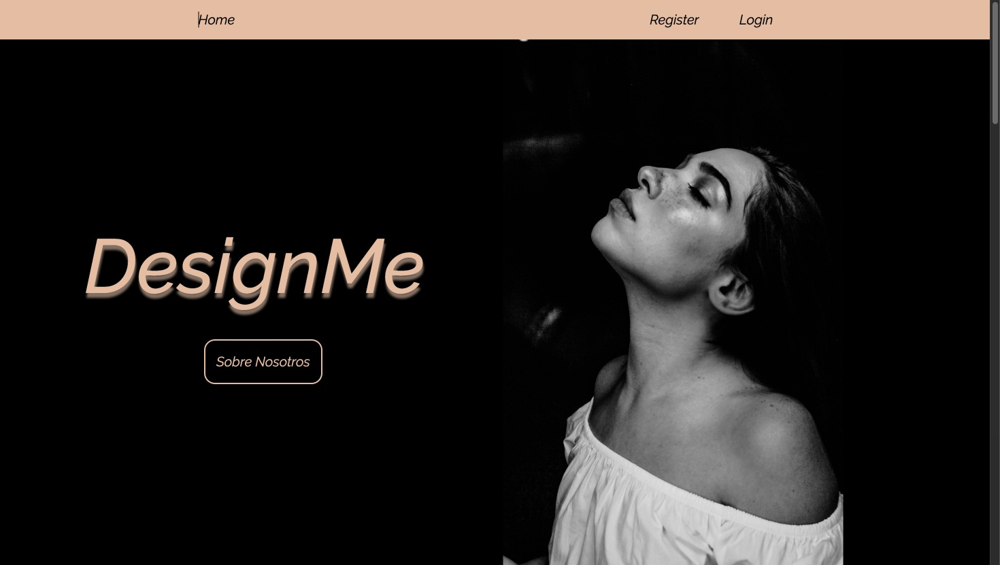
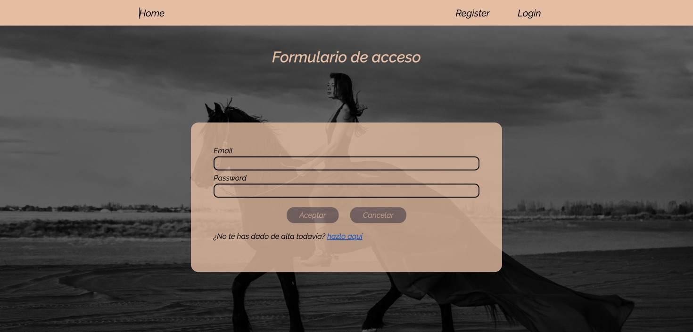
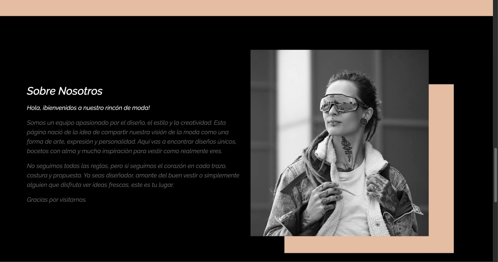
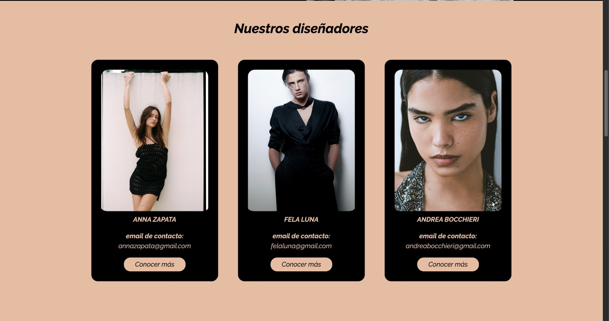
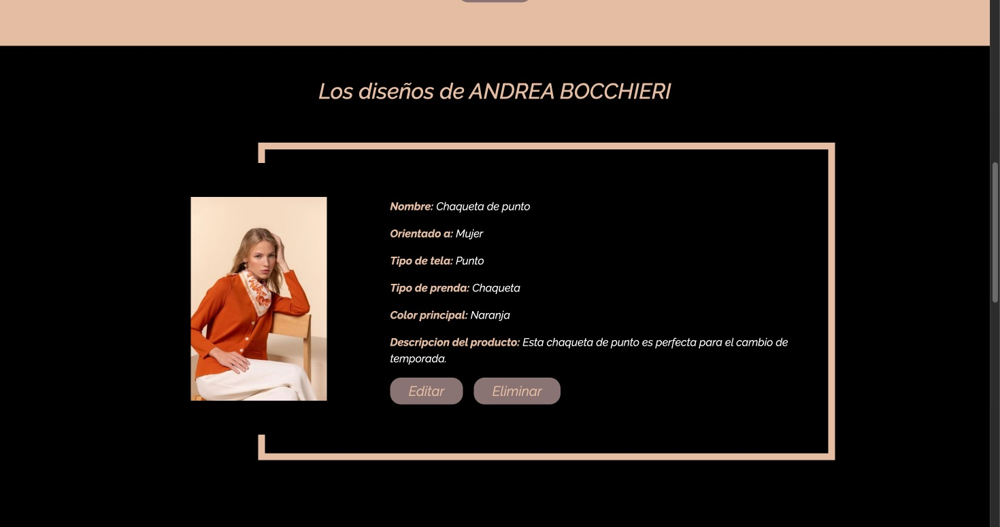

# 🎨 Design

Una red social pensada para diseñadores, donde los usuarios pueden registrarse, crear su perfil y compartir sus diseños con la comunidad. Desarrollada con Node.js, Express y MySQL, este proyecto integra funcionalidades como autenticación segura, subida de imágenes, relaciones entre usuarios y publicaciones, y una interfaz amigable con EJS.

---

## 🎥 Demo en video

[](https://www.youtube.com/watch?v=FmRtWYgttIk&t=208s)

---

## 🚀 Tecnologías utilizadas

### Backend:
- [Node.js](https://nodejs.org/)
- [Express.js](https://expressjs.com/)
- [EJS](https://ejs.co/)
- [MySQL2](https://www.npmjs.com/package/mysql2)
- [Multer](https://www.npmjs.com/package/multer) – subida de imágenes
- [Bcrypt](https://www.npmjs.com/package/bcrypt) – cifrado de contraseñas
- Morgan, Debug, Cookie-Parser, Http-Errors

### Frontend:
- HTML5, CSS3, Bootstrap, JavaScript

---

## ✨ Funcionalidades

- Registro e inicio de sesión de diseñadores
- Cifrado seguro de contraseñas con Bcrypt
- Subida de imágenes de perfil y diseños (Multer)
- Publicación de diseños con descripción y metadatos
- Relación 1:N entre diseñadores y sus diseños
- Eliminación lógica (`is_deleted`)
- Vistas dinámicas con EJS
- 📱 Diseño responsive adaptado a móviles y tablets

---

## 🧠 Aprendizajes aplicados
- Separación de responsabilidades entre vistas (EJS), estilos (CSS) y lógica (Node.js)
- Uso de EJS para renderizado dinámico del frontend
- Arquitectura modular con Express y rutas independientes
- Integración de base de datos relacional (MySQL)
- Manejo de sesiones, cookies y cifrado de contraseñas
- Subida de imágenes y tratamiento de archivos
- ✅ Diseño web responsive con CSS (flexible en diferentes tamaños de pantalla)

## 🖼️ Capturas de pantalla

### Página principal  


### Pantalla de login  


### Registro de diseñador  


### About Us


### Lista de diseñadores


### Perfil de diseñador  


### Lista de diseños  


---

## 🗃️ Estructura de base de datos

```sql
CREATE DATABASE designer_social_network;
USE designer_social_network;

CREATE TABLE designer (
  designer_id INT UNSIGNED PRIMARY KEY AUTO_INCREMENT,
  designer_name VARCHAR(40) NOT NULL,
  lastname VARCHAR(60) NOT NULL,
  password VARCHAR(100) NOT NULL,
  designer_description VARCHAR(200),
  city VARCHAR(60),
  phone_number VARCHAR(20),
  email VARCHAR(100) NOT NULL UNIQUE,
  designer_img VARCHAR(100),
  designer_is_deleted BOOLEAN NOT NULL DEFAULT 0
);

CREATE TABLE design (
  design_id BIGINT UNSIGNED PRIMARY KEY AUTO_INCREMENT,
  designer_id INT UNSIGNED NOT NULL,
  design_name VARCHAR(100) NOT NULL,
  orientation VARCHAR(60) NOT NULL,
  main_fabric VARCHAR(50),
  main_color VARCHAR(50),
  garment_type VARCHAR(50),
  design_description VARCHAR(200),
  design_img VARCHAR(100),
  design_is_deleted BOOLEAN NOT NULL DEFAULT 0,
  CONSTRAINT Fk_designer_id FOREIGN KEY (designer_id)
    REFERENCES designer(designer_id) ON DELETE CASCADE ON UPDATE CASCADE
);
```

---

## 📦 Instalación

```bash
# Clonar el repositorio
git clone https://github.com/miriamespejortega23/Design.git
cd Design

# Instalar dependencias
npm install

# Configurar la base de datos (ver más abajo)

# Iniciar el servidor en modo desarrollo
npm run dev
```

---

## ⚙️ Configuración de la base de datos

Configura tu conexión en un archivo como `config/db.js`:

```js
const mysql = require("mysql2");
const connection = mysql.createConnection({
  host: "localhost",
  user: "root",
  password: "",
  database: "designer_social_network"
});
module.exports = connection;
```

## 📁 Estructura del proyecto

```
designer_social_network/
├── assets/              
├── bin/
│   └── www
├── config/
│   └── db.js
├── public/
│   ├── images/
│   ├── stylesheets/
│   └── js/
├── routes/
│   ├── index.js
│   ├── designers.js
│   └── designs.js
├── sql/
│   └── bd_red_social.sql
├── views/
│   ├── layout.ejs
│   ├── login.ejs
│   ├── register.ejs
│   ├── feed.ejs
│   └── profile.ejs
├── app.js
└── package.json
```

---

## ✅ Estado del proyecto

🟡 Proyecto en desarrollo con funcionalidades principales implementadas.

### Próximas mejoras:
- Sistema de comentarios y "me gusta"
- Validaciones más robustas
- Roles de usuario (admin, diseñador)
- Subida segura con validación MIME

---

## 📬 Contacto

📧 [miriamespejortega@gmail.com](mailto:miriamespejortega@gmail.com)  
💼 [LinkedIn](https://www.linkedin.com/in/miriamespejoort/)  
💻 [GitHub](https://github.com/miriamespejortega23)

---

## 📝 Licencia

Este proyecto fue creado con fines educativos y puede ser reutilizado y adaptado libremente con fines no comerciales.
